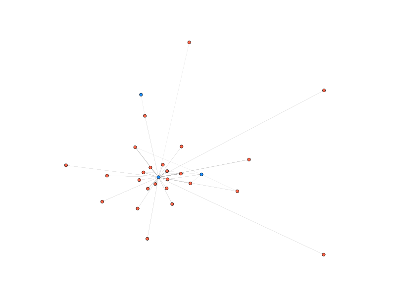

# gitnet

## Overview

`gitnet` is a Python 3 package with tools for collecting, cleaning, and exporting datasets from local Git repositories, as well as creating network datasets and visualizations. The primary purpose of `gitnet` is to provide scholarly tools to study the collaboration structure of free and open source software development projects, but may also be of use to organizations, project managers, and curious coders.

`gitnet` is currently under active development by the University of Waterloo's **NetLab**. The current build offers flexible tools for working with local Git repositories. Future iterations will include support for creating networks using issue report and pull request data, tools for analyzing contributors' communication networks, reproducible data collection, and more tools for increased flexibility. If you are curious about the project, want tips regarding how to use `gitnet`, find a bug, or wish to request a feature, please feel free to email a contributor or submit an issue report.

## A Quick (Meta) Example

`gitnet` makes it easy to collect, clean, and model local Git repositories. Here, we used it to create a network model of contributions to `.py` files in our Git repository.

<br />

```{python}
import gitnet as gn

gn_log = gn.get_log("Users/localpath/gitnet")
gn_log = gn_log.ignore("\.py$",ignoreif = "no match")

gn_net = gn_log.network("author/file")
gn_net = gn_net.node_attributes("colour", helper = gn.author_file_node_colours)
gn_net.quickplot(layout = "spring", fname = "quick.png", size = 40)
```

<br />

This snippet imports `gitnet`, creates a `CommitLog` from our local repository, uses a regular expression to ignore files with names that do not end with `.py`, creates a `MultiGraphPlus` using presets for a bipartite author/file network, adds default file colourings to the graph's node attributes, and saves a basic visualization of the network. (By default, author nodes are coloured blue and python files are coloured red.) The result looks like this:



## Retrieving Data

Currently, only local Git retrieval is supported. Use the `get_log()` function to create a `CommitLog` object, by passing a file path for the Git repository.

```{python}
my_log = gn.get_log("Users/localpath/my_repository")
```

## The `Log` Class

The core data class for all data collected by `gitnet` is a `Log`. `Logs` contain a core dataset of records, attributes documenting its retrieval, and a number of methods to explore, clean, and export the data it contains. In practice, users will generally use a subclass of the `Log` class, with extra features appropriate for the source of their data (e.g. the `Log` subclass for Git commit data is called `CommitLog`, and has methods for generating author-file networks, ignoring files by extension, and so on.)

The core dataset is a dictionary of dictionaries, and held in log.collection. All `Logs` are subscriptable, so you can access individual records directly by their identifiers (e.g. their commit hash).

The basic methods available for `Log` and all its subclasses are as follows:

| Method                | Purpose                                                                           |
|-----------------------|-----------------------------------------------------------------------------------|
| `.attributes()`       | Produces a list of all the tags in the collection.                                |
| `.describe()`         | Prints a detailed, subclass-specific summary of the `Log`                         |
| `.browse()`           | Interactively prints the content of each record in the collection.                |
| `.filter()`           | Selectively remove records using some matching criteria.                          |
| `.tsv()`              | Export a tab delimited spreadsheet containing the collected data.                 |
| `.df()`               | Create a `Pandas` dataframe object using the collected data.                      |
| `.vector()`           | Create a list of all values with a specified tag.                                 |
| `.replace_val()`      | Replace a specified tag value.                                                    |
| `.generate_edges()`   | Creates network edges by record.                                                  |
| `.write_edges()`      | Writes an edgelist (with attributes) to a file.                                   |
| `.generate_nodes()`   | Creates a dictionary of network nodes.                                            |
| `.write_nodes()`      | Writes a list of nodes (with attributes) to a file.                               |
| `.generate_network()` | Creates a network model of the dataset producing a `MultiGraphPlus` object.       |

## The `CommitLog` Subclass

Git commit log datasets are stored as a `CommitLog`, which inherits all the features of a `Log` as well as the following methods:

| Method                | Purpose                                                                |
|-----------------------|------------------------------------------------------------------------|
| `.describe()`         | A `CommitLog` specific summary, which overrides `Log` describe.        |
| `.ignore()`           | Removes files matching a regular expression from all records.          |
| `.network()`          | Contains preset options for generating networks from a `CommitLog`.    |

## The `MultiGraphPlus` Class

When you create a network model using `gitnet`, it is represented as a `MultiGraphPlus` object, which is a subclass of the `networkx` class for undirected graphs with duplicate edges, the `MultiGraph`. `MultiGraphPlus` inherits all the features of a `MultiGraph`, and so can be used with all `networkx` functions that have `MultiGraph` support. However, `MultiGraphPlus` defines a number of new methods to make working with `gitnet` networks more convenient. The methods unique to `MultiGraph` are:

| Method                | Purpose                                                                        |
|-----------------------|--------------------------------------------------------------------------------|
| `.describe()`         | A description of the network.                                                  |
| `.quickplot()`        | Provides presets to easily create network visualizations with one line of code.|
| `.node_attributes()`  | Adds node attributes, with prebuilt or custom helper functions.                |
| `.node_merge()`       | Merges two nodes.                                                              |
| `.collapse_edges()`   | Simplifies a network by merging edges which occur between node pairs.          |
| `.write_graphml()`    | Exports the network as a GraphML file.                                         |
| `.write_tnet()`       | Exports the network as a edge list formatted for the tnet library in R.        |


## Custom Data Sources

If you want to use the features of `gitnet` for an unsupported data source, it is easy to initialize a `Log` object with a custom dataset. First, convert your data into a dictionary of dictionaries, for example:

```{python}
data = {"id1":{"attr1":val1,...,"attrn":valn},
          ⋮
        "idm":{"attr1":val1,...,"attrn":valn}}
```

Then, initialize a `Log` with the dictionary of dictionaries.

```{python}
my_log = Log(dict_of_dict)
```

If you wish to request or contribute support for a new data source, please contact the developers.
